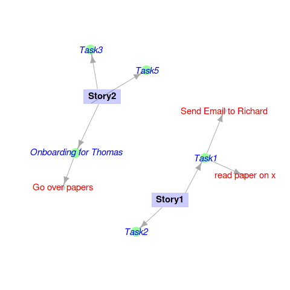

PlanR - An attempt to create visual planning tools in R
=======================================================

These experiments were back from around 2010 during my introduction
to agile methodology and R, where I thought I could merge the two.
There's not a whole lot useful here but it is a demonstration of
graph plotting using igraph and Cairo, as well some Tk interface
usage from R (which "snaps" a configuration after you've dragged
and dropped nodes and edges).

I've almost deleted this project at least 10 times, but I will
keep it.

